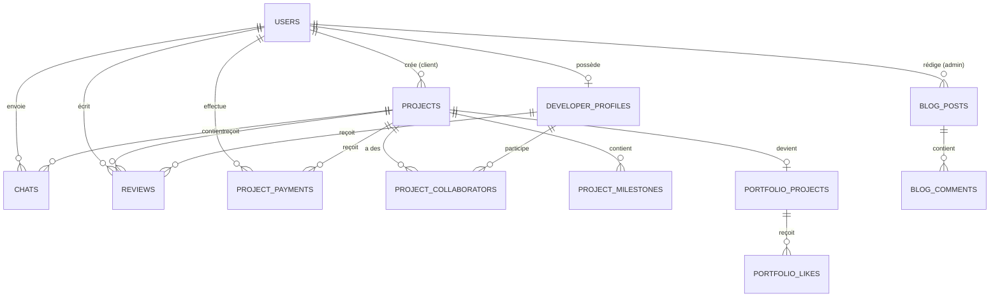

# 📐 MCD - Modèle Conceptuel de Données - Obryl Tech

## 🗂️ Entités Principales

### 1. **USERS** (Utilisateurs)
- 👤 Rôles : `admin`, `client`, `developer`
- 🔐 Authentication + Profile
- 📧 Email vérification

### 2. **DEVELOPER_PROFILES** (Profils Développeurs)
- 💼 Spécialisation, tarif, compétences
- 💰 Balance (solde compte)
- ✅ Vérification admin

### 3. **PROJECTS** (Projets)
- 📋 Titre, description, budget
- 🔄 Statuts workflow (pending → completed)
- 📊 Progression %
- 👔 Client propriétaire

### 4. **PROJECT_COLLABORATORS** (Équipe Projet)
- 👥 Relation Many-to-Many (Projects ↔ Developers)
- 💵 Commission par développeur
- 🏷️ Rôle dans le projet (lead, developer, designer)
- 💳 Statut paiement Escrow

### 5. **PROJECT_MILESTONES** (Jalons)
- 📅 Étapes du projet
- 💰 % de déblocage de fonds
- ✅ Statut (pending, in_progress, completed)

### 6. **PROJECT_PAYMENTS** (Paiements)
- 💳 Transactions client → plateforme
- 🔐 Escrow (fonds bloqués)
- 📊 Type (deposit, milestone, full)

### 7. **CHATS** (Messages)
- 💬 Messagerie par projet
- 📎 Pièces jointes
- ✅ Statut lecture

### 8. **REVIEWS** (Avis)
- ⭐ Notation (1-5 étoiles)
- 💬 Commentaires
- 👤 Client → Développeur

### 9. **PORTFOLIO_PROJECTS** (Portfolio Public)
- 🖼️ Projets publiés
- 🏆 Featured projects
- ❤️ Système de likes

### 10. **BLOG_POSTS** (Articles)
- 📝 Contenu technique
- 🏷️ Catégories, tags
- 👁️ Vues

---

## 🔗 Relations entre Entités



---

## 📊 Cardinalités Détaillées

### Relations Utilisateurs

| Relation | Type | Description |
|----------|------|-------------|
| User → DeveloperProfile | 1:1 | Un dev = un profil unique |
| User (client) → Projects | 1:N | Un client crée N projets |
| User → Chats | 1:N | Un user envoie N messages |
| User → Reviews | 1:N | Un client écrit N avis |

### Relations Projets

| Relation | Type | Description |
|----------|------|-------------|
| Project → ProjectCollaborators | 1:N | Un projet a N développeurs |
| Project → ProjectMilestones | 1:N | Un projet a N jalons |
| Project → ProjectPayments | 1:N | Un projet reçoit N paiements |
| Project → Chats | 1:N | Un projet a N messages |
| Project → PortfolioProject | 1:1 | Un projet publié = 1 portfolio |

### Relations Développeurs

| Relation | Type | Description |
|----------|------|-------------|
| DeveloperProfile → ProjectCollaborators | 1:N | Un dev participe à N projets |
| DeveloperProfile → Reviews | 1:N | Un dev reçoit N avis |

---

## 🎨 Schéma Visuel Simplifié

```
┌─────────────────────────────────────────────────────────────────┐
│                         OBRYL TECH DATABASE                      │
└─────────────────────────────────────────────────────────────────┘

                    ┌──────────────┐
                    │    USERS     │
                    │ (Polymorphe) │
                    └──────┬───────┘
                           │
           ┌───────────────┼───────────────┐
           │               │               │
    ┌──────▼──────┐  ┌────▼────┐  ┌──────▼────────┐
    │   CLIENTS   │  │  ADMIN  │  │  DEVELOPERS   │
    └──────┬──────┘  └────┬────┘  └──────┬────────┘
           │              │               │
           │              │         ┌─────▼─────────────┐
           │              │         │ DEVELOPER_PROFILES│
           │              │         │   (Compétences)   │
           │              │         └─────┬─────────────┘
           │              │               │
      ┌────▼──────────────▼──────────┐   │
      │        PROJECTS               │   │
      │  (Titre, Budget, Statut)     │◄──┘
      └────┬──────────┬──────────┬───┘
           │          │          │
    ┌──────▼─────┐ ┌─▼──────┐ ┌─▼────────────┐
    │ MILESTONES │ │ CHATS  │ │ COLLABORATORS│
    │  (Jalons)  │ │(Msgs)  │ │   (Équipe)   │
    └────────────┘ └────────┘ └──────────────┘
           │
    ┌──────▼────────────┐
    │ PROJECT_PAYMENTS  │
    │    (Escrow)       │
    └───────────────────┘

    ┌──────────────────┐
    │ PORTFOLIO_PUBLIC │
    │   (Vitrine)      │
    └──────────────────┘

    ┌──────────────────┐
    │   BLOG_POSTS     │
    │  (Articles)      │
    └──────────────────┘
```

---

## 🔑 Clés et Contraintes

### Clés Primaires
- Toutes les tables : `id` (BIGINT UNSIGNED AUTO_INCREMENT)

### Clés Étrangères Critiques
1. `projects.client_id` → `users.id` (CASCADE DELETE)
2. `project_collaborators.developer_id` → `users.id` (CASCADE DELETE)
3. `project_payments.project_id` → `projects.id` (CASCADE DELETE)
4. `chats.project_id` → `projects.id` (CASCADE DELETE)

### Indexes Recommandés
```sql
-- Performance queries
INDEX idx_projects_status (status)
INDEX idx_projects_client (client_id, status)
INDEX idx_collaborators_developer (developer_id)
INDEX idx_chats_project_created (project_id, created_at DESC)
INDEX idx_payments_project (project_id, status)

-- Recherche fulltext
FULLTEXT INDEX ft_projects_search (title, description)
FULLTEXT INDEX ft_blog_search (title, content)
```

### Contraintes Uniques
- `users.email` (UNIQUE)
- `projects.code` (UNIQUE) - Format : PRJ-2025-001
- `project_collaborators (project_id, developer_id)` (UNIQUE)

---

## 📋 Énumérations (ENUM)

### Status Workflows

```php
// Users
'status' => ['active', 'inactive', 'suspended']
'role' => ['admin', 'client', 'developer']

// Projects
'status' => [
    'pending',      // En attente validation admin
    'accepted',     // Accepté par admin
    'in_progress',  // En cours de développement
    'review',       // Livraison en révision
    'completed',    // Terminé et payé
    'published',    // Publié sur portfolio
    'cancelled',    // Annulé
    'dispute'       // Litige Escrow
]

// Payments
'status' => ['pending', 'completed', 'failed', 'refunded']
'payment_type' => ['deposit', 'milestone', 'full']

// Collaborators
'payment_status' => ['pending', 'released', 'refunded']
'role' => ['lead', 'developer', 'designer', 'tester']
```

---

## 💾 Taille Estimée Base de Données (Année 1)

| Table | Nb Lignes Estimé | Taille Approx |
|-------|------------------|---------------|
| users | 5,000 | 2 MB |
| developer_profiles | 500 | 500 KB |
| projects | 2,000 | 10 MB |
| project_collaborators | 5,000 | 1 MB |
| chats | 50,000 | 25 MB |
| reviews | 1,000 | 500 KB |
| blog_posts | 100 | 2 MB |
| **TOTAL** | **~63K lignes** | **~41 MB** |

**Note :** Images/fichiers stockés séparément (S3/filesystem)

---

## 🔐 Sécurité des Données

### Données Sensibles
- `users.password` → Hashed (bcrypt)
- `project_payments.transaction_id` → Encrypted
- `developer_profiles.balance` → Audit trail

### Soft Deletes
Tables avec `deleted_at` :
- `users`
- `projects`
- `blog_posts`

### Logs d'Audit
Recommandé : Utiliser `spatie/laravel-activitylog`
- Actions admin sur projets
- Modifications de balance développeur
- Déblocages de paiements Escrow
