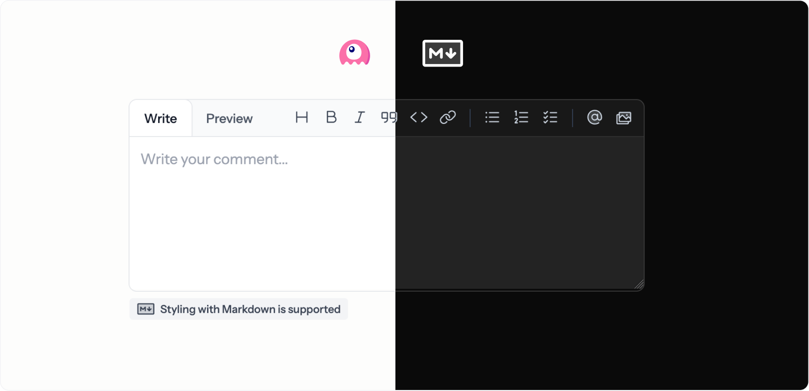

# Laravel Markdown Editor

<p>
    
</p>

<p>
    <a href="https://github.com/mckenziearts/livewire-markdown-editor/actions"></a>
    <a href="https://packagist.org/packages/mckenziearts/livewire-markdown-editor"></a>
    <a href="https://packagist.org/packages/mckenziearts/livewire-markdown-editor"></a>
    <a href="https://packagist.org/packages/mckenziearts/livewire-markdown-editor"></a>
</p>

GitHub-style Markdown editor for Laravel with Livewire and Alpine.js. This module provides a complete, standalone Markdown editing experience with full dark mode support.

## Dependencies

- Laravel 11+
- Livewire 3.6+
- Tailwind CSS 4.1
- League CommonMark
- GitHub Markdown Toolbar Element
- GitHub Text Expander Element

## Features

- 🎨 GitHub-style toolbar with all formatting options
- 📝 Live markdown preview
- 🌓 Full dark mode support
- 📎 File upload with automatic Markdown insertion
- ✨ GitHub Flavored Markdown (GFM) support
- 🔖 Spatie Shiki Highlight code blocks
- 📋 Tables, task lists, and more
- 🔄 Livewire integration with two-way binding
- 🎯 Multiple editor instances support

## Installation

Livewire Markdown editor can be installed via composer from your project root:

```bash
composer require mckenziearts/livewire-markdown-editor
```

Include the Markdown formatting buttons for text inputs Editor into your project:

```bash
npm install --save @github/markdown-toolbar-element @github/text-expander-element
```

### 2. Load assets

Add the module's JavaScript to your main `resources/js/app.js`:

```js
import '../../vendor/mckenziearts/livewire-markdown-editor/resources/js/markdown-editor.js';
```

And the CSS file to your main `resources/css/app.css`:

```css
@import "../../vendor/mckenziearts/livewire-markdown-editor/resources/css/markdown-editor.css";
```

Then build:

```bash
npm run build
```

### 3. Register the module

The service provider is auto-discovered via Laravel's package discovery.

## Usage

### Basic Usage

```blade
<livewire:markdown-editor wire:model="content" />
```

### With Custom Configuration

```blade
<livewire:markdown-editor
    wire:model="comment"
    placeholder="Write your comment..."
    :rows="15"
    :show-toolbar="true"
    :show-upload="true"
/>
```

### In Livewire Components

```php
use Livewire\Component;

class CreatePost extends Component
{
    public string $content = '';

    public function save()
    {
        $this->validate([
            'content' => 'required|min:10',
        ]);

        // $this->content contains the markdown
    }

    public function render()
    {
        return view('livewire.create-post');
    }
}
```

```blade
<div>
    <livewire:markdown-editor wire:model="content" />

    <button wire:click="save">Save</button>
</div>
```

## Component Properties

| Property      | Type   | Default                | Description                                  |
|---------------|--------|------------------------|----------------------------------------------|
| `content`     | string | `''`                   | The markdown content (use with `wire:model`) |
| `placeholder` | string | `'Leave a comment...'` | Textarea placeholder text                    |
| `class`       | string | `null`                 | Textarea custom classes                      |
| `rows`        | int    | `10`                   | Number of textarea rows                      |
| `showToolbar` | bool   | `true`                 | Show/hide the markdown toolbar               |
| `showUpload`  | bool   | `true`                 | Show/hide the file upload button             |

## Toolbar Features

- **Heading** - Insert heading
- **Bold** - Make text bold
- **Italic** - Make text italic
- **Quote** - Insert blockquote
- **Code** - Insert code block
- **Link** - Insert link
- **Unordered List** - Insert bullet list
- **Ordered List** - Insert numbered list
- **Task List** - Insert checklist
- **File Upload** - Upload and insert files/images

## File Uploads

Files are automatically uploaded to `storage/app/public/` when selected. Images are inserted as `` and other files as `[filename](url)`.

Make sure your storage is properly configured:

```bash
php artisan storage:link
```

## Markdown Support

The editor supports full GitHub Flavored Markdown including:

- Headings
- Bold, italic, strikethrough
- Links and images
- Code blocks with syntax highlighting
- Task lists
- Blockquotes
- Horizontal rules

## Dark Mode

Dark mode is fully supported and automatically follows your Tailwind CSS dark mode configuration.

## Customization

### Publishing Views

```bash
php artisan vendor:publish --tag=livewire-markdown-editor-views
```

Views will be published to `resources/views/vendor/livewire-markdown-editor/`.

### Publishing Assets

```bash
php artisan vendor:publish --tag=livewire-markdown-editor-assets
```

## License

Distributed under the MIT license. See LICENSE for details.
